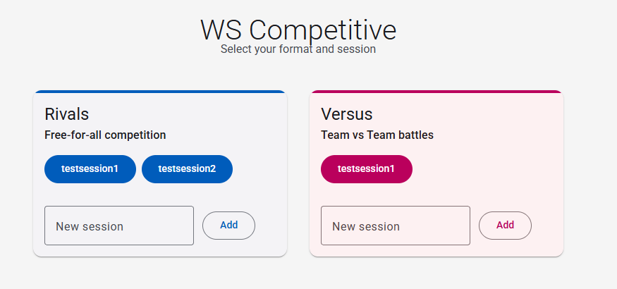
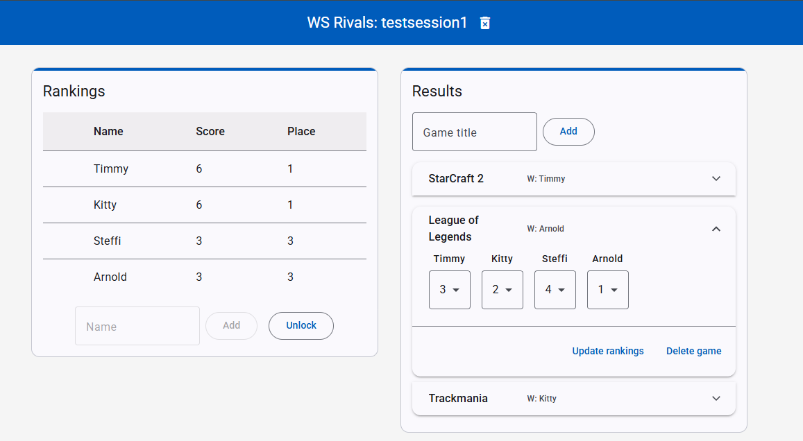
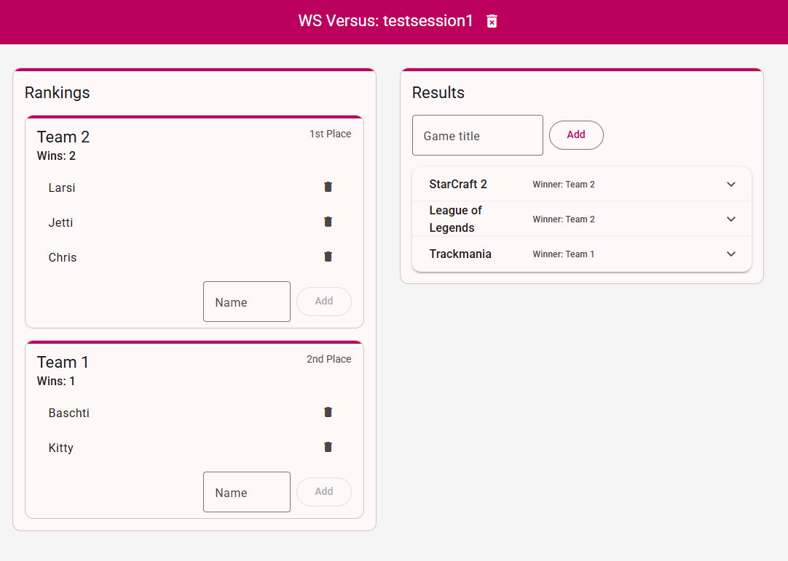

# WS Competitive

A web app for managing competitive sessions, games, and players. Includes two modes: Free For All (Rivals) and Team-Play (Versus).

## Features

- Create and manage sessions
- Add/remove games and players
- Assign teams and track results
- Real-time updates via polling
- Two Sub-Apps

## Local Development & Tunneling

1. **Frontend**:
   - Built with Angular.
   - Run locally or deploy to Firebase Hosting.

2. **Backend**:
   - Node.js/Express server.
   - Run locally:
     ```
     npm run start-rivals   # for Rivals mode
     npm run start-versus   # for Versus mode
     ```
   - Use HTTP tunneling (e.g., [localtunnel](https://github.com/localtunnel/localtunnel), [ngrok](https://ngrok.com/)) to expose your local backend for remote access.

3. **API URLs**:
   - IMPORTANT: Configure Angular environment files to point to your tunnel URL.

## Screenshots

- Landing Page  
  

- Rivals App  
  

- Versus App  
  

## Getting Started

1. Clone the repo.
2. Install dependencies in both `backend` and `src` folders.
3. Start backend and frontend servers.
4. Set up HTTP tunnel for backend if not deployed in development state.
5. Access the app via your browser.

## Notes

- Data is stored locally in JSON files.
- For remote access, keep your tunnel active.
- For production, consider cloud hosting for the backend.

---
